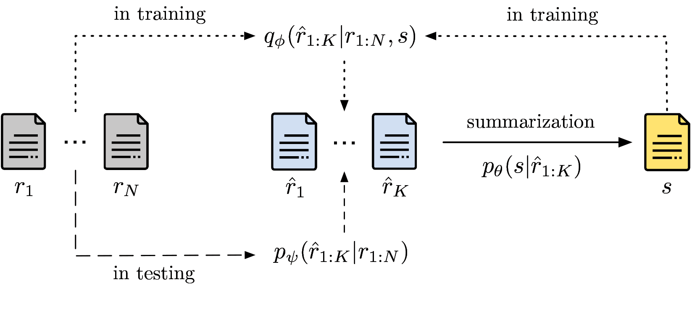

# Learning Opinion Summarizers by Selecting Informative Reviews

This repository contains the codebase and the dataset for the [corresponding EMNLP 2021 paper](https://arxiv.org/abs/2109.04325). Please star the repository and cite the paper if you find it useful.

**SelSum** is a probabilistic (latent) model that selects informative reviews from large collections and subsequently summarizes them as shown in the diagram below. 

<p align="center">

</p>

**AmaSum** is the largest abstractive opinion summarization dataset, consisting of more than **33,000** human-written summaries for Amazon products. Each summary is paired, on average, with more than **320** customer reviews. Summaries consist of **verdicts**, **pros**, and **cons**, see the example below.

### Example Summary

<p align="center">

</p>

**Verdict:**
*The Olympus Evolt E-500 is a compact, easy-to-use digital SLR camera with a broad feature set for its class and very nice photo quality overall.*
 
**Pros:** 
* *Compact design*
* *Strong autofocus performance even in low-light situations*
* *Intuitive and easy-to-navigate menu system* 
* *Wide range of automated and manual features to appeal to both serious hobbyists and curious SLR newcomers*

**Cons:**
* *Unreliable automatic white balance in some conditions*
* *Slow start-up time when dust reduction is enabled*
* *Compatible Zuiko lenses don't indicate focal distance*


## 1. Setting up


### 1.1. Environment
The easiest way to proceed is to create a separate [conda environment](https://docs.conda.io/projects/conda/en/latest/) with Python 3.7.0. 

``
conda create -n selsum python=3.7.0
``

Further, install PyTorch as shown below.

``
conda install -c pytorch pytorch=1.7.0
``

In addition, install the essential python modules:

```
pip install -r requirements.txt
```

The codebase relies on **FairSeq**. To avoid version conflicts, please download [our version](https://abrazinskas.s3.eu-west-1.amazonaws.com/downloads/projects/selsum/fairseq_lib.zip) and store it to `../fairseq_lib`. 
Please follow the installation instructions in the unzipped directory. 

### 1.2. Environmental variables

Before running scripts, please add the environmental variables below.

```
export PYTHONPATH=../fairseq_lib/.:$PYTHONPATH
export CUDA_VISIBLE_DEVICES=0,1,2,3
export MKL_THREADING_LAYER=GNU
```

### 1.3. Data

The dataset in various formats is available in the [dataset folder](/data).
To run the model, please **binarize** the fairseq specific version.

### 1.4. Checkpoints

We also provide the checkpoints of the trained models. These should be allocated to `artifacts/checkpoints`.

* [Summarizer (with posterior)](https://abrazinskas.s3.eu-west-1.amazonaws.com/downloads/projects/selsum/artifacts/checkpoints/selsum.pt)
* [Prior](https://abrazinskas.s3.eu-west-1.amazonaws.com/downloads/projects/selsum/artifacts/checkpoints/prior.pt)

## 2. Training

### 2.1. Posterior and Summarizer training

First, the posterior and summarizer need to be trained. The summarizer is initialized using the BART base model, please [download the checkpoint](https://abrazinskas.s3.eu-west-1.amazonaws.com/downloads/projects/selsum/artifacts/bart/bart.base.pt) and store it to `artifacts/bart`.
Note: please adjust **hyper-parameters** and **paths** in the script if needed.

```
bash selsum/scripts/training/train_selsum.sh
```

Please note that **REINFORCE-based** loss for the posterior training can be negative as the forward pass does not correspond to the actual loss function. Instead, the loss is re-formulated to compute gradients in the backward pass (Eq. 5 in the paper).

### 2.2. Selecting reviews with the Posterior

Once the posterior is trained (jointly with the summarizer), informative reviews need to be selected. The script below produces binary tags indicating selected reviews. 

```
python selsum/scripts/inference/posterior_select_revs.py --data-path=../data/form  \
--checkpoint-path=artifacts/checkpoints/selsum.pt \
--bart-dir=artifacts/bart \
--output-folder-path=artifacts/output/q_sel \
--split=test \
--ndocs=10 \
--batch-size=30
```

The output can be [downloaded](https://abrazinskas.s3.eu-west-1.amazonaws.com/downloads/projects/selsum/artifacts/outputs/q_sel.zip) and stored to `artifacts/output/q_sel`.

### 2.3. Fitting the Prior

Once tags are produced by the posterior, we can fit the prior to approximate it.

```
bash selsum/scripts/training/train_prior.sh
```

### 2.4. Selecting Reviews with the Prior

After the prior is trained, we select informative reviews for downstream summarization.

```
python selsum/scripts/inference/prior_select_revs.py --data-path=../data/form \
--checkpoint-path=artifacts/checkpoints/prior.pt \
--bart-dir=artifacts/bart \
--output-folder-path=artifacts/output/p_sel \
--split=test \
--ndocs=10 \
--batch-size=10
```
 
The output can be [downloaded](https://abrazinskas.s3.eu-west-1.amazonaws.com/downloads/projects/selsum/artifacts/outputs/p_sel.zip) and stored to `artifacts/output/p_sel`.

## 3. Inference


### 3.1. Summary generation
To generate summaries, run the command below:

```
python selsum/scripts/inference/gen_summs.py --data-path=artifacts/output/p_sel/ \
--bart-dir=artifacts/bart \
--checkpoint-path=artifacts/checkpoints/selsum.pt \
--output-folder-path=artifacts/output/p_summs \
--split=test \
--batch-size=20
```

The model outputs are also available at `artifacts/summs`.

### 3.2. Evaluation

For evaluation, we used a [wrapper over ROUGE](https://github.com/pltrdy/files2rouge) and the CoreNLP tokenizer. 

The tokenizer requires the [CoreNLP library](http://nlp.stanford.edu/software/stanford-corenlp-full-2016-10-31.zip) to be downloaded. Please unzip it to the `artifacts/misc` folder. Further, make it visible in the classpath as shown below.

```
export CLASSPATH=artifacts/misc/stanford-corenlp-full-2016-10-31/stanford-corenlp-3.7.0.jar
```

After the installations, please adjust the paths and use the commands below.

```
GEN_FILE_PATH=artifacts/summs/test.verd
GOLD_FILE_PATH=../data/form/eval/test.verd

# tokenization
cat "${GEN_FILE_PATH}" | java edu.stanford.nlp.process.PTBTokenizer -ioFileList -preserveLines > "${GEN_FILE_PATH}.tokenized"
cat "${GOLD_FILE_PATH}" | java edu.stanford.nlp.process.PTBTokenizer -ioFileList -preserveLines > "${GOLD_FILE_PATH}.tokenized"

# rouge evaluation
files2rouge "${GOLD_FILE_PATH}.tokenized" "${GEN_FILE_PATH}.tokenized"
```


## Citation
```
@inproceedings{bražinskas2021learning,
      title={Learning Opinion Summarizers by Selecting Informative Reviews}, 
      author={Arthur Bražinskas and Mirella Lapata and Ivan Titov},
      booktitle={Proceedings of the Conference on Empirical Methods in Natural Language Processing (EMNLP)},
      year={2021},
}
```

## License

**Codebase**: MIT

**Dataset**: non-commercial


## Notes

* Occasionally logging stops being printed while the model is training. In this case, the log can be displayed either with a gap or only at the end of the epoch.
* SelSum is trained with a single data worker process because otherwise cross-parallel errors are encountered.
